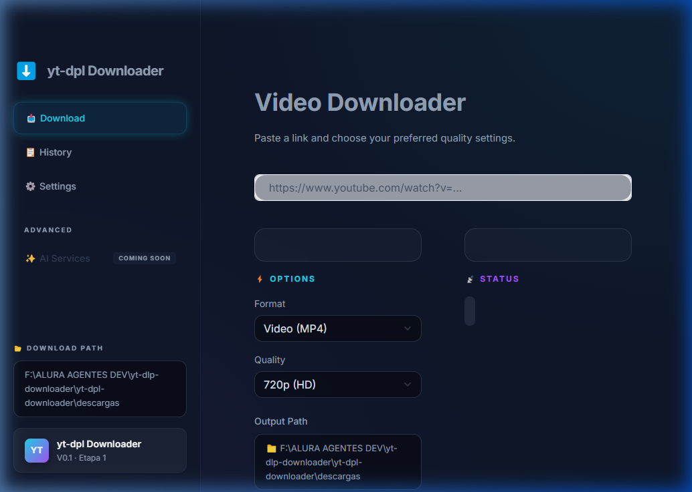
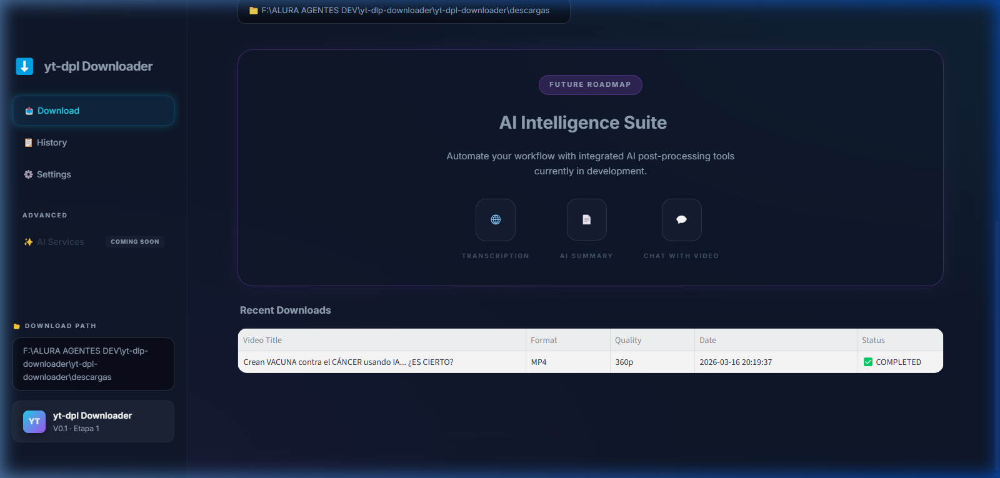

# yt-dpl Downloader V0.3 - 

Este proyecto simplifica la descarga de contenido multimedia mediante herramientas de código abierto como `yt-dlp` y `FFmpeg`. **Interfaz gráfica moderna** con Streamlit, estética futurista, escalable a IA.

## Preview
### Vista Principal

### AI Suite + Historial  


## 📁 Estructura
```
yt-dpl-downloader/
├── app/
│   ├── main.py           # UI Streamlit
│   ├── core/downloader.py # yt-dlp logic  
│   ├── data/history.json # Historial local
│   └── utils/
├── descargas/           # Output
├── yt-dlp.exe
├── ffmpeg.exe
├── Lanzar_Hub.bat       # Doble clic → Listo
└── README.md
```

## Uso Gráfico (Streamlit)
1. **Doble clic** `Lanzar_Hub.bat`
2. **Browser abre** `http://localhost:8501`
3. **Pega URL** → Formato/Calidad → **⬇️ Download**

**Nuevas Funcionalidades (V0.3)**:
- ✅ **Solo 1er video** playlists (no bucles infinitos)
- ✅ **Sin warnings** JavaScript  
- ✅ Botón **deshabilitado** durante descarga
- ✅ **Warning** playlist detectada
- ✅ Barra progreso + historial

## 💻 Terminal (Opcional)
```powershell
# 720p (default)
.\yt-dlp.exe -f \"bv[height<=720][ext=mp4]+ba[ext=m4a]\" --merge-output-format mp4 \"URL\"

# MP3 solo
.\yt-dlp.exe -x --audio-format mp3 \"URL\"
```

## Seguridad Verificada (BLACKBOXAI Audit)
- ✅ **SSL seguro** (sin bypass certificados)
- ✅ Paths sanitizados  
- ✅ subprocess seguro (tkinter)
- ✅ Local-only (sin APIs externas)
- ✅ No command injection

## Setup Manual
```powershell
python -m streamlit run app/main.py
.\yt-dlp.exe --update  # Actualizar
```

## Roadmap Etapa 2: IA Suite
- 🌐 **Transcripción** auto
- 📄 **Resúmenes** IA
- 💬 **Chat** con videos

## Aviso Legal
**Uso educativo únicamente**. Respeta derechos de autor y términos de servicio.

## Créditos
- [yt-dlp](https://github.com/yt-dlp/yt-dlp)
- [FFmpeg](https://ffmpeg.org)
- [Streamlit](https://streamlit.io)

---
**V0.3 (2026) - Bucle fijo, seguridad OK, listo para producción**
